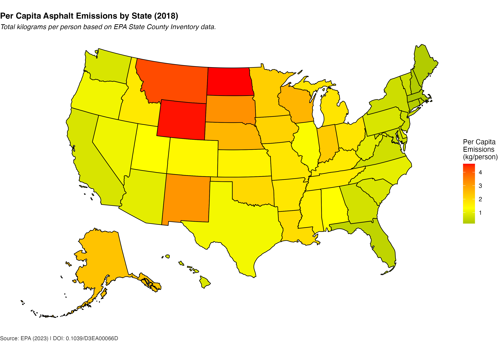

# 2018 U.S. Asphalt Emissions Study

## Project Overview

This project visualizes 2018 U.S. asphalt emissions by state using data from the U.S. Environmental Protection Agency (EPA). The analysis focuses on per capita emissions, providing a clear geographical representation of asphalt-related emissions across the United States.

## Visualization



## Data and Citations

**Data Source:** U.S. EPA 2018 State County Inventory  
*Data: U.S. EPA 2018 State County Inventory*

**Research:**  
Anthropogenic secondary organic aerosol and ozone production from asphalt-related emissions, Environ. Sci.: Atmos., 2023, 3, 1221-1230. https://doi.org/10.1039/D3EA00066D

## Project Structure

```
.
├── data/               # Raw EPA Excel files
├── plots/              # Generated choropleth maps
├── emissions_map.R     # Main processing script
└── README.md           # Project documentation
```

## Methodology

The analysis follows a structured pipeline:
1. Data is downloaded from the EPA's public repository
2. The "Output - State" sheet is extracted and processed
3. Data is cleaned and transformed for visualization
4. A choropleth map is generated with appropriate styling and annotations

## Limitations

- The dataset covers only 2018 data
- State-level data may not capture county-level variations
- Emissions data represents per capita values and may not reflect total emissions

## Acknowledgements

This project was developed as part of a research initiative on transportation-related emissions and their environmental impacts.